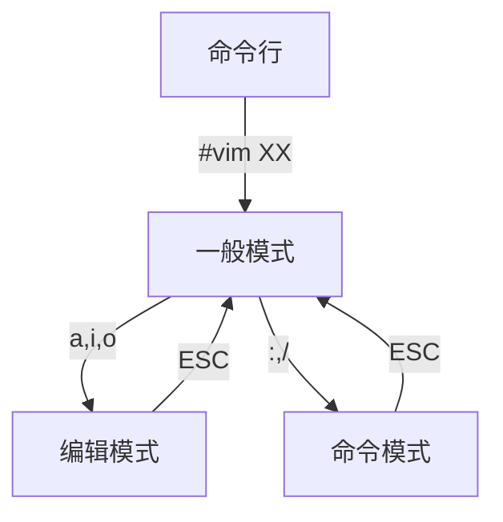
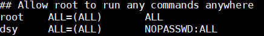
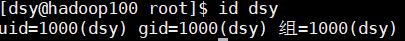
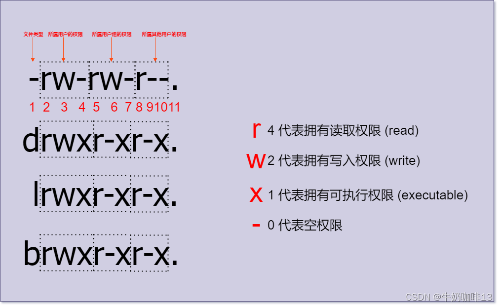
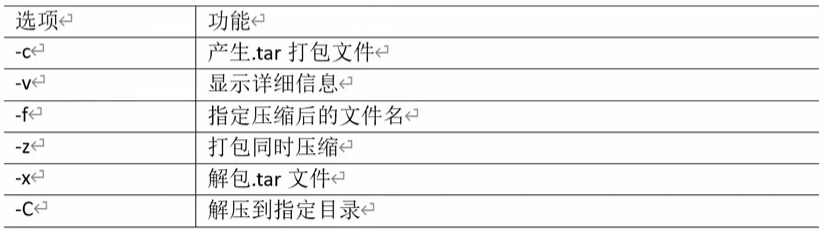

### Linux 学习

#### 基础篇

[B 站教程](https://www.bilibili.com/video/BV1WY4y1H7d3/?spm_id_from=333.999.0.0&vd_source=f0c4b48f250aff3964a610f470b29cd5)
桥接网络：在局域网中虚拟机和主机等价
NAT 网络地址转换：虚拟机把主机当作路由器

引导分区在 _/boot_ 目录下
交换分区 swap 划分一部分磁盘作为虚拟内存
剩下的都挂载在到根分区 / 下面

进入终端：
centOS：ctrl alt F2~F6||F1 回到桌面
Ubuntu：ctrl alt F1~F6||F7 回到桌面

编辑：选择字体界面
查看：改变窗口大小

root 用户：# || 普通用户:$

###### 根目录下的各个文件夹

|            名称            |                  作用                  |
| :------------------------: | :------------------------------------: |
| bin（user/bin 的快捷方式） | 存放可直接执行命令的二进制代码 比如 cd |
|     sbin（user/sbin）      |   存放管理员才可执行命令的二进制代码   |
|  lib/ lib64 （user/lib）   |        系统共享库文件类似于 DLL        |
|            usr             |             用户的所有文件             |
|            boot            |              引导分区文件              |
|            dev             |        设备目录，比如 cpu、gpu         |
|            etc             |              系统配置文件              |
|            home            |              用户的主目录              |
|            root            |           超级管理员的主目录           |
|            opt             |       可选目录 一般装第三方软件        |
|           media            |               U 盘、光驱               |
|            mnt             |          相当于另外一个 media          |
|            proc            |             虚拟的进程目录             |
|            run             |         当前系统运行的实时信息         |
|            srv             |                系统服务                |
|            sys             |              系统硬件信息              |
|            tmp             |                临时目录                |
|            var             |          可变目录 比如放日志           |

###### VIM 编辑器

###### 一般模式(删除复制粘贴)

u：undo 退回  
复制：y
粘贴：p
删除：d
选中一个单词：w
剪切一个字符：x
剪切上一个字符：X （类似于 delete 键）
移动到行尾：$
移动到行头：^
移动到下一个单词：e
移动到上一个单词：b
移动到文件尾：G

###### 编辑模式(记住 i 就行):

i：当前光标前
a：当前光标后
o：下一行开始
I：行首
A：行尾
O：上一行开始

###### 命令模式

设置行号：set nu (nonu)
wq：写入、退出
q：退出
q!：不保存强制退出
/要查找的词：n 查找下一个、N 查找上一个
noh：查找完取消高亮显示
替换：
:s/old/new 当前行匹配到的第一个
:s/old/new/g 当前行所有
:%s/old/new/g 所有

#### 网络篇

桥接模式：直连路由器，暴露在局域网内。
NAT 模式：此时主机作为局域网路由器的外网入口，网卡 1 连接到局域网内，保证可以互通。
主机模式：网卡 2 连接到局域网内的**交换机**，无法连接外网。

###### 更改 linux 主机网络配

vim /etc/sysconfig/network-scripts/ifcfg-ens33

添加如下代码：
#IP 地址 ←
IPADDR=192.168.202.100 #网关
GATEWAY=192.168.202.2 #域名解析器
DNS1=192.168.202.2

重启服务：
service network restart

ifconfig：查看网络信息

修改 host 文件，添加对应 ip 映射关系
vin etc/hosts
192.168.111.100 hadoop100
192.168.111.101 hadoop101
192.168.111.102 hadoop102
192.168.111.103 hadoop103
192.168.111.104 hadoop104

cmd 远程登录：ssh [usr name]@hadoop100

#### 系统管理篇

服务：常驻内存的进程
基本语法：service 服务名 start|stop|restart|status
systemctl start|stop|restart|status 服务名
_这部分内容做了解就好_

#### 常用基本命令

##### 1、帮助命令

man
type 查看命令类型
--help
crtl+l = clear 清屏
reset 重启工作区
alias 查看别名命令

##### 文件目录类

###### 操作目录类

pwd：print working directory
cd - 回到上一个目录
cd ../ 使用相对目录

root 下： cd+pwd /root
dsy 用户下： cd+pwd /home/dsy
su dsy 切换 dsy 用户

ls -a 显示所用文件
.开头的是隐藏文件
ls-l=ll 显示文件详细信息
ls / 显示/下面的目录

创建目录 mkdir
递归创建 mkdir a/b/C

删除目录 rmdir
递归删除 rmdir -p a/b/c

###### 操作文件类

创建文件 touch 默认是 txt 文件
使用 vim +文件 创建文件时，空文件会直接删除

复制文件 cp [文件] [目录]
\cp [文件] [已经存在的文件] 会直接替换内容

在使用 touch 创建文件时，如果不直接指明文件类型，就可以直接用文件名字选中文件
但是如果使用如 touch b.txt 创建，就必须用 cp b.txt /home/dsy/ （指明文件类型）

删除文件 rm
rm -f 强制执行
rm -r 删除文件夹
rm -rf /_ 删库跑路命令
rm -f ./_ 删除当前目录所有文件

移动文件 mv
mv [文件] [路径] 文件移动到路径下
mv [源文件] [目标文件] 替换

查看文件内容 cat more less
cat -n [文件名] 显示行号

more [文件名]
space 翻页
q 退出
= 行号
v 进入 vim 编辑器
:f 输出文件名和行号

less [文件名]
space= pagedown 翻页
/字串 搜寻 n 下一个 N 上一个
= 显示信息
g/G 到文件开头结尾

echo 输出指令
直接输出 echo "hello world"
带转移字符 echo -e "hello \n world"
echo 写入文件
echo "内容">>文件 （向 host 文件添加静态 IP）
ls >info 将 ls 信息*覆盖*info 文件
ll >>info 将 ll 信息*追加*到文件末尾

head -n [文件名] 查看文件头 n 行
tail -n [文件名] 查看文件尾 n 行
tail -f [文件名] 监控文件
本质上是根据文件号来追踪文件，可以监视到 echo >>的内容
对于 echo >会显示文件已被截断
对于 vim 直接编辑文件不会输出信息。因为这时产生了新的文件号
ls -i [文件名] 查看文件号

ln 软链接
ln -s [源文件绝对路径] [目标目录]
pwd -P 显示当前真实路径
cd -P 进入真实路径
硬链接 ln [源文件绝对路径] [目标目录] 相当于复制了一份文件

history n 显示历史信息
![命令号] 重复执行第 n 条命令
history -c 清空历史

###### 时间日期类

date
cal

###### 用户管理命令

useradd [用户名] 添加用户
userdel [-r] [用户名] 删除用户 [-r]是否删除目录
useradd -d /home/dave david 创建 david 用户，并以 dave 作为他的主文件夹
passwd [用户名] 为用户添加密码
id [用户名] 查看有无此用户
su [用户名] 跳转用户
/etc/passwd 已有用户信息
whoami 登录用户信息
————————————————
**例子：**
[root@hadoop100 ~]# who am i
root pts/0 2024-10-19 21:00 (192.168.32.1)
[root@hadoop100 ~]# su dsy
[dsy@hadoop100 root]\$ whoami
dsy
[dsy@hadoop100 root]$ who am i
root pts/0 2024-10-19 21:00 (192.168.32.1)
————————————————
sudo [命令] 用超级管理员权限执行
修改 /etc/sudoers 添加权限

组的概念：把拥有同样权限的用户放到一个组内

每个用户会有一个与自己同名的组，一个用户可以属于多个组
组的信息文件在 /etc/group 下
创建组 groupadd [组名]
添加用户 usermod -g [dsy] [组名]
删除用户 groupdel [dsy]
改组名 groupmod -n [新名字] [旧名字]
wheel 组权限
Allows people in group wheel to run all commands
%wheel ALL=(ALL) ALL

文件权限类

drwxr-xr-x. 16 root root 4096 10 月 16 19:08 .config
d：directory 目录文件
b：block device，块设备文件
c：character device，字符设备文件
l：symbolic link
p：pipe：管道文件
s：socket，套接字文件
16（数字）的含义：作为目录代表子文件夹、作为目录代表硬链接数

更改文件权限 chmod
<image src="文件权限修改.png" width=500/>
chmod [rwx] 直接对其他用户操作
使文件属主、所在组、其他用户都对该文件（及其子文件）有读、写、执行操作
chmod -R 777 [file_name/]

更改文件所有者 chown [dsy] [filename]
更改文件所属组 sudo chgrp [group] [filename]

查找文件
find [目录] [选项]
-name 名字
-size 大小
-user 用户
例子：
find /home/dsy - name "*.txt"
find -user dsy
find /home/dsy -size -2M
locate [filename]快速定位文件
先使用updatedb 更新数据库

查找命令
which   绝对路径
whereis 绝对路径+源代码
which cd

grep过滤查找以及 “|” 管道操作符
【命令一】|【命令二】
命令二处理命令一查找到的结果
例1：
grep  -n boot initial-setup-ks.cfg 
查找 .cfg 文件中boot 出现的地方 
-n 表示显示行号
例2：
grep  boot initial-setup-ks.cfg|wc
结果：8 32 318 
8行 32个词 318大小
例3：
ls |grep -n .cfg
挑出.cfg文件

压缩解压类
gzip  gunzip 不可压缩文件夹
zip  unzip  
tar 打包文件 结合gzip可以压缩（使用最多）

例：
将目录下的 info 文件打包压缩，然后解压到myinfo文件夹中
tar -zcvf info.tar.gz info
tar -xvf info.tar.gz -C myinfo
总结：打包zcvf 解压xvf -C