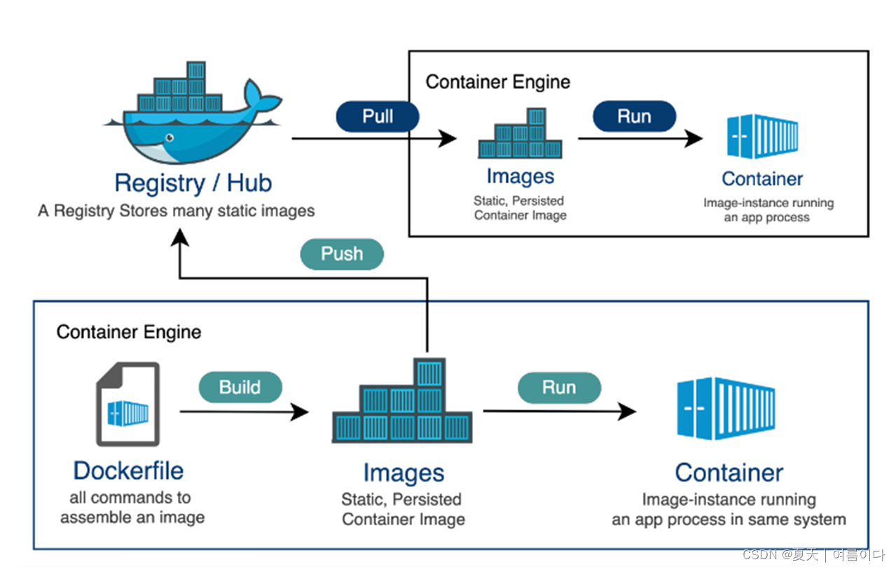

[**markdown 基本语法**](https://blog.csdn.net/w11111xxxl/article/details/140783343)

```mermaid
graph gannt

```

**什么是 pyc 文件？**
[教程](https://blog.csdn.net/answer3lin/article/details/87374093)
二进制文件，由 python 虚拟机执行

**markdown 快捷键系列**
[教程](https://blog.csdn.net/i_Satan/article/details/134693813)
**粗体快捷键**：由于 ctrl+B 的快捷键被占用，所以改成了 ctrl+alt+1

预览 ctrl+shift+v

**yaml 文件，也是一种键值对文件，类似于 xml，json**
[教程](https://zhuanlan.zhihu.com/p/60747338)

**docker 初步入门学习**
[10 分钟学会 Docker 的安装和使用](https://blog.csdn.net/yohnyang/article/details/138435593)
[Docker | 深度学习中的 docker 看这一篇就够啦](https://blog.csdn.net/weixin_44649780/article/details/128327264)
[【Docker】基于 docker 构建深度学习开发环境](https://blog.csdn.net/u011119817/article/details/110386437)


|      | 类似于   |
| ---- | -------- |
| 镜像 | class    |
| 容器 | instance |

在我的电脑上
docker run -it --gpus=all --ipc=host --rm -v C:\Users\nnmm\Desktop:/workspace -w /workspace --name base my_image:v1.0 /bin/bash

设置vs code菜单栏大小
>open settings
 window.zoomLevel

vscode 提交卡住：设置 Use Editor As Commit input 取消勾选

生成ssh-密钥：
ssh-keygen -t rsa -C[ssh 链接]
windows下 用户--.ssh--id_rsa.pub
